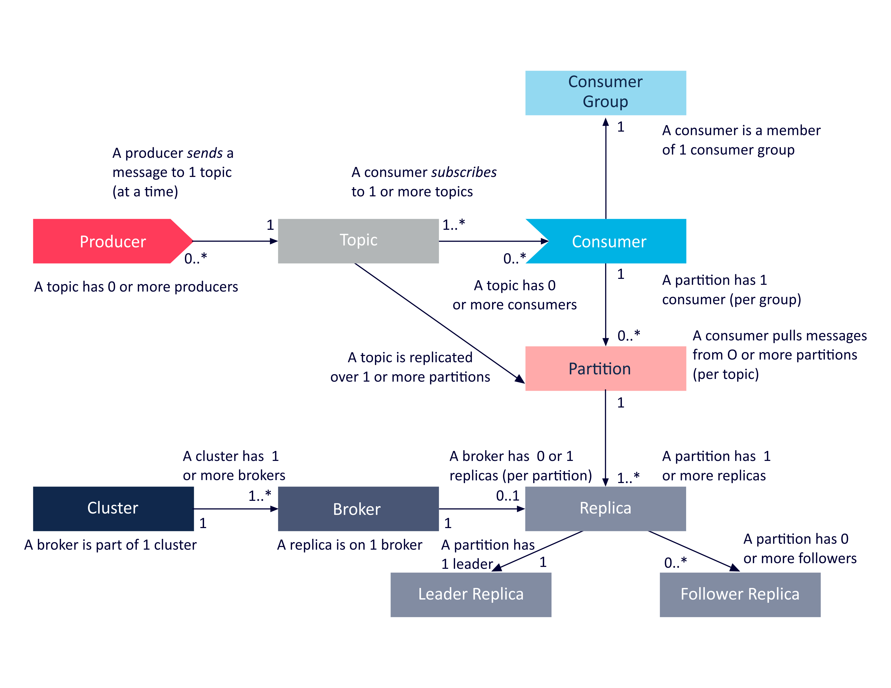

# Kafka

1. Kafka Key与Partition的关系。
> 答：消息在发送前会组装成K/V结构，消息通过其中的Partition或Key来确认Partition，当没有显式指名分区时，便会通过计算Key的Hash来分区。但是如果没有Key，也没有Partition，那就会先通过topic查询本地分区表（每隔*topic.metadata.refresh.interval.ms*刷新一次）找出分区，如果分区不存在，则会随机算出分区。

2. 描述Kafka Controller
> 答：Controller是Broker中选举出的控制器，它本身是一个Broker，不过它会负责Partition、副本状态管理，比如重分配Partition，其LeaderSelector会选择新Leader，并更新ISR到ZK，同时通过所有副本更新Leader与ISR。

3. Kafka 的ISR有哪些地方维护
> 答：Controller（被选举的Broker）与Leader。Controller见(KafkaController)[#5]，Leader中有线程检测ISR是否有follower脱离，有则将ISR列表返回ZK。

4. Kafka扩容后如何保证数据仍然在老分区

5. 分区重平衡发生在什么时候

6. 简述Cluster、Broker、Producer、Topic、Consumer、Partition、Replica的映射关系

7. [为什么Kafka这么快](./kafka-fast.md)
