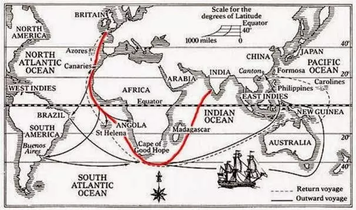

# 啤酒百科

## IPA是什么

[知乎IPA](https://zhuanlan.zhihu.com/p/28153430):

IPA是现在最流行的一种精酿啤酒的缩写，India Pale Ale，翻译为印度淡色艾尔，但是这种啤酒并非源自印度，而是源于英国，出口至印度的一种高酒精度高苦读的啤酒。
IPA起源于18世纪初期，在英国人统治印度时期，相比于印度的水，英国人宁愿天天喝自己的啤酒。但是要将啤酒从英国运到印度，则需要经过长达数月的长途旅行，
期间还要两次穿越赤道，所以前期的英式波特和淡色艾尔啤酒总是不能禁受得住时间和温度的考验。因此，为了提高啤酒的保存能力，酿酒厂让啤酒在运输过程中持续发酵以此来提高啤酒的酒精度，
并在酿造过程中加大了啤酒花的使用量，啤酒花是天然的防腐剂，从而有效的延长了啤酒的保质期，印度淡色艾尔从此成型。虽然这类啤酒大约在18世纪就已经开始生产并出口至印度，
但是IPA这个名字却是在1820年才第一次出现在酒厂的广告宣传中，当时宣传为“Pale India Ale”，直到1828年， “India Pale Ale”才第一次出现在孟加拉报（Bengal Hukaru Newspaper）上。

但是随着运输、酿造技术、禁酒运动和世界大战的影响，这种高酒精度高苦度的IPA啤酒变得越来越落寞，而低酒精度适合畅饮的拉格啤酒却在逐步的占领着市场。直到20世纪70年代，英国发起了“真艾运动”（Campaign For Real Ale）以及同时期在美国兴起的“精酿运动”，又再次将IPA这种啤酒重新带回大众的视野。也正是因此，IPA从最开始的一种啤酒风格演变成了英式IPA和美式IPA。两种IPA相比较，英式IPA更加稳重，麦芽和酒花的香味均衡不激烈；美式IPA奔放不羁，爆裂的酒花香味总会让人难以忘却，如今美式IPA已被看做是现在精酿啤酒的典范，而且从美式IPA也演变出了越来越多的IPA风格。

[IPA简史](https://www.theguardian.com/lifeandstyle/2015/jan/30/brief-history-of-ipa-india-pale-ale-empire-drinks)

The initials stand for India pale ale. It was the answer to the problem of providing beer for the British Empire in the east. 
It was too hot to brew in India, so what was needed was a beer that could survive the gruelling six-month journey from Britain intact. 
In the 1780s, a London brewer called Hodgson answered the call by sending out a strong, heavily hopped beer called 
October ale that would normally be aged like wine before drinking. The beer not only survived the journey, 
but was found to have improved immeasurably. This was the prototype IPA; the beer gradually became paler and more refreshing 
to suit the Indian climate.

Hodgson’s beer was imitated by bigger brewers, such as Bass. It evolved into something weaker, just plain old pale ale, 
for the home market. With the coming of refrigeration, proper IPA itself began to die out. Until that is the Americans 
rediscovered their love of brewing some time around 1976. The craft brewers in the States merrily set about recreating 
forgotten British styles – including IPA. Being American, they didn’t do things by halves. These new ales were packed with 
alcohol and hops.

可见，IPA有一段时间时消亡了的，随时制冷技术的出现，不再需要古老的常温远程运输，转而是冷藏远程运输，所以啤酒的原味得以保存。直到1976年，
美国的酿酒师们兴起了再造不列颠风格酒的浪潮，这些酒里面就包括了IPA。美国人再现了IPA，也没有像19世纪那样半途而废，英国人将美国人的复现手艺带到了美国。

从美国出发，IPA横跨大西洋，穿越一百年，回到了英国。IPA的发展就像旅程一样：240年前，湿冷气候下英国人为了远洋酷热的印度市场发明了IPA，消逝近半世纪后被60年前美国人复现，又被抄回它的故乡英国。

## 为什么啤酒花可以消毒