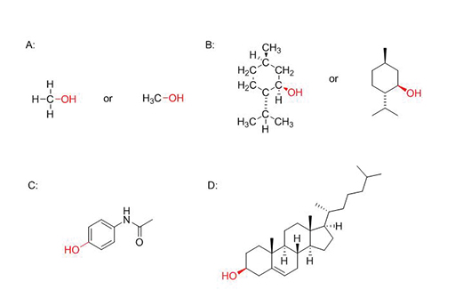
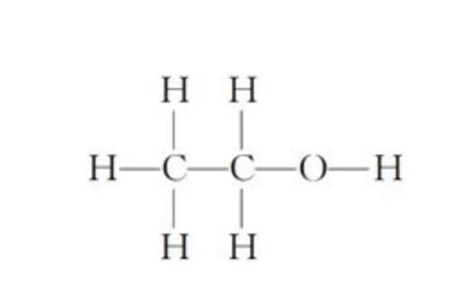
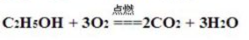
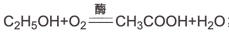

# 酒精的常识

现实生活中我们会看到许多种类的酒品，可能会有很多同学想到过，为什么光超市里货架上白酒、啤酒就有这么多种，每一种如果不看商标基本都叫不上名字，从而连其中的成分的区别就更无从说起了。要了解一款酒，我们需要从发酵说起，而发酵最主要的目的就是生成酒精，酒精就是让人酒后产生醉意的物质。通常只要喝过酒的人，都会有感觉到醉的生理反应，我们会通过本章的学习介绍酒精的生成及其对我们人体产生的影响。

如果同学们在看这篇文章，那说明大家或多或少都会喝过一些奇奇怪怪的酒，也或者，未来会品尝到一些喜欢的、未涉猎到的分支。当我们去品尝一款喜欢的酒时，是否都在猜想，都是些什么东西游离在手中的杯子里？是通过哪些步骤一一凑齐这些成分，才呈现出口中的味道？

酿造和蒸馏通过几千年的发展，将化学、生物和工程学以独特方式结合，通过这一系列，我们会给大家介绍不同种类的啤酒，还有杜松子酒这些年这么火的原因，尝试找出酿造感兴趣的酒品方法，在自己的闲暇时间小酌几口。

接下来的部分，我们会给大家分几个主题介绍这门课程。

首先我们从乙醇（酒精的主要成分）说起，介绍它的化学特性与物理属性；紧接着，介绍酵母及其在发酵过程中将碳水化合物（蔗糖、淀粉等）转换成二氧化碳与乙醇的过程；
酵母之后我们介绍如何在家酿造简单酒；最后介绍酒类产品的生产历史，和酒在我们文化中的影响。

> 如果大家已经有了初高中化学知识，知晓酵母工作的化学原理，那可以快速跳过这一节。对于不是很清楚这一知识点的同学，我们会用基础的科学原理来给大家这些关键物质。

通过本章的学习后，大家将会掌握如下知识点：

* 乙醇的分子式及与其它醇类的区别
* 乙醇易被身体吸引的原因
* 乙醇的基础化学反应
* 发酵反应的原理及因素
* 人类早期文明中酒精相关的历史

## 科学中的酒精

酒类在工业上的生产混合了化学、生物学与工程学，人类整合这一产业已经有几千年之久。我们身边往往都会见到很多种啤酒、烈酒。问个问题，为什么会有这么多种类的白酒？
酒精在身体中又是如何流转的，宿醉为何难受？我们先从什么是醇类开始讲起。

### 醇类

从这里开始讲起有助于大家了解什么是酒精，通过这些介绍，我们以后的课程理解起来会更简单，同时促进我们了解它的相关科学原理，以及，『酒精』一词有着通俗和特定的含义。

一般而言，我们提到酒精时都会关联到酒精饮料，比如啤酒、鸡尾酒、白酒之类，但我们还是要更深层次去了解它。从科学的角度来说，酒精是一种醇，而醇是一类化合物（化合物的基本单位是由多个原子组成的分子）的总称，其分子包含羟基（-OH）与碳原子（C）键。下图我们展示了几种醇类的化学分子式。

> 分子中的原子是通过**键**连接的，我们不需要去过深了解，知道这个术语即可。

上图几个醇类的分子中，红色部分就是羟基。注意图中的羟基有两种写法，-OH或HO-，取决于O原子在分子中的位置，不论是哪种写法，都是通过O氧原子与C碳原子相连的。

现在介绍一下上图中的4个分子  
* A：甲醇（methanol）。甲醇是最简单的醇类，它只有1个C碳原子，3个氢原子及一个羟基（-OH）。通常可以简写成CH3OH，或H3C-OH，一般中国教材都是用前一种写法。
* B：薄荷醇（Menthol）。 薄荷醇是在我们常见的薄荷中发现，它可以当成温和的麻醉剂，可以让神经细胞产生冰凉感。从图中左半部分是它的分子结构，也可以简写成右边的结构，六边形代表是个碳环。
* C：对乙酰氨基酚（Paracetamol，扑热息痛）。这是我们生活中常见的止痛和退烧药，它也是一种醇类，同时，作为药物，剂量大时有生命危险。分子式中的N是氮原子。
* D：胆固醇（Cholesterol）。大家都很熟悉了，在动物的细胞中广泛存在，并且是一种保持生命机体的基本分子，它参与生成一些激素及重要的化学物质。然而，过多的胆固醇会导致心血管疾病。

我们介绍的这几个醇类都是学术上的示例，是为了给大家科普醇类的丰富与不同作用。在醇类中用一种我们开始学习乙醇，也就是常说酒精中的主要成分，在生活中不严格的场景下，我们说的酒精就是乙醇。乙醇自然也是属于醇类的一员，它也包含有一个-OH羟基。

### 乙醇（ethanol）

前面的小节我们讲到醇类的成员中可入酒的叫做乙醇，它的分子式是C2H5OH，如果大家是真心喜欢酒这门文化与学科，这个化学式就一定要记下来。

上图是乙醇的分子结构图，右侧我们看到有一个羟基，所以，它也是一个醇类。

* 乙醇中有9个原子，分别是2个碳原子、5个氢原子以及一个羟基-OH中的各一个氢氧原子
* 乙醇的结构要记下来，我们需要用到它的结构去理解乙醇的亲水性，以及如何穿过我们的细胞膜影响我们的身体。

#### 乙醇的物理特性

乙醇分子极小，它可以轻松穿过我们的胃壁与小肠直入血液中。乙醇最重要的两个特性如下：

* 乙醇可完全溶解于水，任何水、乙醇的比例混合，都可以互相溶解。
不像其它物质与水混合后，有溶解度的概念，比如氯化钠（食用盐的主要成分）在一定的温度下达到溶解度后就不再溶于水，多投入的部分会沉入水底。而乙醇则可以完全与水混合，这个特性使其极易通过我们的血液等水性体液传输到全身各处。
* 乙醇的沸点比水低。这点非常重要，我们可以用这个特性来提纯高浓度的烈酒。

#### 乙醇的化学反应

当化合物分子中的原子发生重排列，导致有新的分子产生，就是发生了化学反应。乙醇有几种重要的化学反应，以后的课程中我们会介绍更多的反应，但是这一节我们只讲两个最重要的反应：

* 与空气中的氧气反应燃烧
* 转换成醋酸，醋酸是我们食醋中产生酸性的成分

在讲述乙醇的化学反应之前，我们先来了解一下化学反应方程式。我们用自然界中最基本的一个化学反应来入门：

上图就是氢气和氧气燃烧反应生成水的化学式，但是这并不是化学方程式，化学方程式需要配平（balancing)。
 
配平的意思是指化学式两边的原子数量要一致。配平后如下：

配平后的公式，意思是说，2个氢气分子与1个氧气分子经过燃烧反应生成一个H2O水分子。

##### 乙醇燃烧

当我们燃烧酒精时，它本质上是与空气中的氧气（O2）反应

1个乙醇分子与3个O2氧分子反应，生成2个CO2二氧化碳分子，3个水H2O水分子

这个方程式大家也要记住，它与酒精在我们肝脏中反应产生的物质是一样的，不过酒精燃烧的反应过于猛烈，而在肝脏中则分了三个相对平缓得多的阶段分解成水和二氧化碳。

##### 葡萄酒的酸化

我们喝打开过的葡萄酒时，如果上次软木塞没有放好，时间长了，酒味尝起来就会酸酸的，这个时候，酒已经和氧气发生了反应，不过，与燃烧不同的是，这里反应足够缓慢，产生的物质也不相同。这个反应产生了让人感觉出酸味的醋酸（CH3COOH）。

该反应并不会独立发生，把酒精和氧气常温混合在一起，并不会有氧化反应的发生，但是在空气中的醋酸杆菌提供的酶作用下，便会发生反应，醋酸杆菌繁殖过程中会消耗酒精产生能量驱动它的生命活动。所以，在保存红酒时，一般会把空气隔离，放入一些防腐剂，比如二氧化硫等，避免有细菌的混入、繁殖。

发酵产生乙醇帮助我们生成酒精饮料，同样，某些情况我们也会利用醋酸杆菌这个反应来生产其它饮料，比如苹果酒醋。

##### 乙醇发酵

发酵的本身是新陈代谢的过程（新陈代谢维持了生命体的生命体征，当新陈代谢停止时，生命体也宣告死亡），该过程通过细胞将大分子转换成小分子，释放出能量与代谢产物。微生物在细胞内通过分解糖，